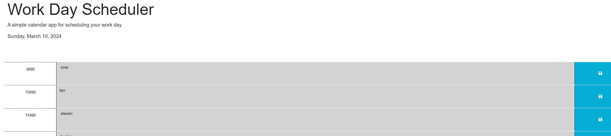

# Work Day Scheduler

## Work Day Scheduler
This is a javascript application that uses Jquery and local storage to manage text-based tasks that the user submits and renders elements on the page based on the time as accessed through dayjs.

## Installation
This application runs in your browser and does not require installation.

Here is a screenshot and a link to the running website
[Work Day Scheduler](https://danpatoneil.github.io/Work-Day-Scheduler/)

## Use
This application allows users to schedule one task per time of day. The app remembers tasks through local storage and color codes the times of day based on whether they are past, present, or future hours. 

## Future Iterations
In future iterations, I would like to add functionality to have each time slot be a list of 4 or 5 tasks where the user could manually click on completed tasks to remove them from the list. This would require a reorganization of the html and having each localStorage item be an array and use JSON parsing/stringifying to store and access them.

MIT License

Copyright (c) 2024 Daniel O'Neil

Permission is hereby granted, free of charge, to any person obtaining a copy
of this software and associated documentation files (the "Software"), to deal
in the Software without restriction, including without limitation the rights
to use, copy, modify, merge, publish, distribute, sublicense, and/or sell
copies of the Software, and to permit persons to whom the Software is
furnished to do so, subject to the following conditions:

The above copyright notice and this permission notice shall be included in all
copies or substantial portions of the Software.

THE SOFTWARE IS PROVIDED "AS IS", WITHOUT WARRANTY OF ANY KIND, EXPRESS OR
IMPLIED, INCLUDING BUT NOT LIMITED TO THE WARRANTIES OF MERCHANTABILITY,
FITNESS FOR A PARTICULAR PURPOSE AND NONINFRINGEMENT. IN NO EVENT SHALL THE
AUTHORS OR COPYRIGHT HOLDERS BE LIABLE FOR ANY CLAIM, DAMAGES OR OTHER
LIABILITY, WHETHER IN AN ACTION OF CONTRACT, TORT OR OTHERWISE, ARISING FROM,
OUT OF OR IN CONNECTION WITH THE SOFTWARE OR THE USE OR OTHER DEALINGS IN THE
SOFTWARE.